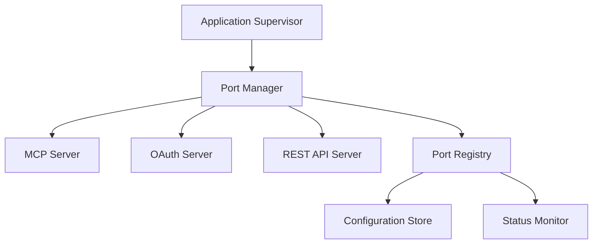

# Design Document

## Overview

The port management system will provide robust, configurable network port allocation with automatic conflict resolution for the ErlVectorDB application. The design implements a centralized Port Manager that handles port binding, conflict detection, fallback mechanisms, and status reporting across all network services.

## Architecture

The port management system follows a layered architecture:



### Key Components:

1. **Port Manager**: Central coordinator for all port operations
2. **Port Registry**: Maintains active port bindings and availability
3. **Configuration Store**: Manages port ranges and service configurations
4. **Status Monitor**: Tracks service health and port usage
5. **Service Adapters**: Interface between Port Manager and individual services

## Components and Interfaces

### Port Manager (`port_manager.erl`)

**Responsibilities:**
- Coordinate port allocation across all services
- Detect and resolve port conflicts
- Maintain service startup order
- Provide port status API

**Interface:**
```erlang
-module(port_manager).
-behaviour(gen_server).

%% API
-export([
    start_link/0,
    allocate_ports/1,
    release_ports/1,
    get_port_status/0,
    get_service_port/1,
    force_restart_service/1
]).

%% Types
-type service_name() :: mcp_server | oauth_server | rest_api_server.
-type port_config() :: #{
    service => service_name(),
    preferred_port => integer(),
    port_range => {integer(), integer()},
    required => boolean()
}.
-type port_allocation() :: #{
    service => service_name(),
    allocated_port => integer(),
    status => bound | failed | released
}.
```

### Port Registry (`port_registry.erl`)

**Responsibilities:**
- Track which ports are allocated to which services
- Detect port availability
- Manage port ranges and restrictions

**Interface:**
```erlang
-module(port_registry).

%% API
-export([
    register_port/2,
    release_port/1,
    is_port_available/1,
    find_available_port/1,
    get_all_allocations/0
]).

%% Types
-type port_binding() :: #{
    port => integer(),
    service => service_name(),
    pid => pid(),
    bind_time => integer()
}.
```

### Configuration Manager (`port_config.erl`)

**Responsibilities:**
- Load port configuration from multiple sources
- Validate port ranges and settings
- Provide configuration defaults

**Interface:**
```erlang
-module(port_config).

%% API
-export([
    load_config/0,
    get_service_config/1,
    validate_config/1,
    get_port_ranges/0
]).

%% Types
-type config_source() :: application_env | config_file | environment_vars.
-type service_config() :: #{
    preferred_port => integer(),
    port_range => {integer(), integer()},
    bind_interface => string(),
    required => boolean()
}.
```

## Data Models

### Port Allocation Record
```erlang
-record(port_allocation, {
    service :: service_name(),
    port :: integer(),
    pid :: pid() | undefined,
    status :: allocated | bound | failed | released,
    allocated_at :: integer(),
    bind_attempts :: integer(),
    last_error :: term() | undefined
}).
```

### Service Configuration Record
```erlang
-record(service_config, {
    name :: service_name(),
    preferred_port :: integer(),
    port_range :: {integer(), integer()},
    bind_interface :: string(),
    required :: boolean(),
    startup_order :: integer(),
    health_check_path :: string() | undefined
}).
```

### Port Registry State
```erlang
-record(port_registry_state, {
    allocations :: #{integer() => port_allocation()},
    available_ranges :: [{integer(), integer()}],
    reserved_ports :: [integer()],
    config :: #{service_name() => service_config()}
}).
```

## Correctness Properties

*A property is a characteristic or behavior that should hold true across all valid executions of a system-essentially, a formal statement about what the system should do. Properties serve as the bridge between human-readable specifications and machine-verifiable correctness guarantees.*

<function_calls>
<invoke name="prework">
<parameter name="featureName">port-management

### Property 1: Port Conflict Detection
*For any* port that is already in use, when the Port Manager attempts to bind to it, the system should detect the conflict and log a warning message
**Validates: Requirements 1.1**

### Property 2: Automatic Fallback Selection
*For any* port conflict within a configured range, the Port Manager should automatically select the next available port in the predefined range
**Validates: Requirements 1.2**

### Property 3: Range Exhaustion Handling
*For any* port range where all ports are occupied, the Port Manager should return a descriptive error message when no ports are available
**Validates: Requirements 1.3**

### Property 4: Fallback Logging
*For any* service that uses a fallback port, the Port Manager should log the actual port being used for that service
**Validates: Requirements 1.4**

### Property 5: Port Range Validation
*For any* port selection, the Port Manager should only select ports within valid ranges (1024-65535 for non-privileged ports)
**Validates: Requirements 1.5**

### Property 6: Configuration Loading
*For any* valid configuration source (environment variables or config files), the system should correctly read and apply port configuration
**Validates: Requirements 2.1**

### Property 7: Custom Range Compliance
*For any* custom port range configuration, the Port Manager should only select ports within those specified ranges
**Validates: Requirements 2.2**

### Property 8: Default Configuration Fallback
*For any* startup without custom configuration, the system should use sensible default port ranges
**Validates: Requirements 2.3**

### Property 9: Per-Service Configuration
*For any* service (MCP, OAuth, REST API), the system should support separate port range configuration
**Validates: Requirements 2.4**

### Property 10: Configuration Validation
*For any* invalid port range configuration, the system should return a configuration error with specific details
**Validates: Requirements 2.5**

### Property 11: Startup Port Logging
*For any* successful application startup, the system should log the actual ports used by each service
**Validates: Requirements 3.1**

### Property 12: Port Status API Availability
*For any* running system, there should be an API endpoint available to query current port assignments
**Validates: Requirements 3.2**

### Property 13: Port Status Response Completeness
*For any* port status query, the system should return service names, assigned ports, and binding status
**Validates: Requirements 3.3**

### Property 14: Port Registry Maintenance
*For any* port operation (bind/release), the Port Manager should maintain an accurate registry of all active port bindings
**Validates: Requirements 3.4**

### Property 15: Port Release Registry Update
*For any* service that stops, the Port Manager should update the port registry to reflect the released port
**Validates: Requirements 3.5**

### Property 16: Pre-Service Port Binding
*For any* system startup, all required ports should be successfully bound before any services are started
**Validates: Requirements 4.1**

### Property 17: Startup Failure Cleanup
*For any* port binding failure during startup, the system should release all previously bound ports and terminate gracefully
**Validates: Requirements 4.2**

### Property 18: Service Startup Ordering
*For any* successful port binding, services should start in their configured dependency order
**Validates: Requirements 4.3**

### Property 19: Startup Error Reporting
*For any* service startup failure, the system should provide clear error messages indicating which service failed and why
**Validates: Requirements 4.4**

### Property 20: Startup Resource Cleanup
*For any* startup failure, the system should clean up all partially initialized resources
**Validates: Requirements 4.5**

### Property 21: Development Mode Port Selection
*For any* development mode startup, the system should support automatic port selection starting from configurable base ports
**Validates: Requirements 5.1**

### Property 22: Development Mode Timeouts
*For any* development mode operation, the system should use shorter timeouts for port binding attempts compared to production mode
**Validates: Requirements 5.3**

### Property 23: Force Restart Cleanup Sequencing
*For any* force restart operation, the system should wait for proper cleanup before attempting to bind ports
**Validates: Requirements 5.5**

### Property 24: Container Interface Binding
*For any* container deployment configuration, the system should support binding to all interfaces (0.0.0.0)
**Validates: Requirements 6.1**

### Property 25: Container Environment Variable Handling
*For any* container environment with PORT variables set, the system should respect those environment variables for each service
**Validates: Requirements 6.2**

### Property 26: Health Check Endpoint Availability
*For any* running system, health check endpoints should be available on known ports for container orchestration
**Validates: Requirements 6.3**

### Property 27: Container Port Mapping Logging
*For any* container deployment with port mapping, the system should log both internal and external port mappings
**Validates: Requirements 6.4**

### Property 28: Graceful Shutdown Signal Handling
*For any* SIGTERM signal received, the system should perform graceful shutdown for proper container lifecycle management
**Validates: Requirements 6.5**

## Error Handling

### Port Conflict Resolution Strategy
1. **Detection**: Use `gen_tcp:listen/2` with `{reuseaddr, false}` to detect conflicts
2. **Logging**: Log conflicts at warning level with service name and attempted port
3. **Fallback**: Increment port number within configured range
4. **Exhaustion**: Return `{error, {no_ports_available, Range}}` when range is exhausted

### Configuration Error Handling
1. **Validation**: Validate all port ranges at startup
2. **Defaults**: Fall back to sensible defaults for missing configuration
3. **Error Reporting**: Provide specific error messages for invalid configurations
4. **Graceful Degradation**: Continue with valid services if some configurations fail

### Service Startup Error Handling
1. **Atomic Operations**: Either all services start or none do
2. **Cleanup**: Release all allocated ports on any startup failure
3. **Error Propagation**: Bubble up specific error reasons to supervisors
4. **Recovery**: Support restart attempts with different port allocations

## Testing Strategy

### Unit Testing
- Test port conflict detection with mock socket operations
- Test configuration loading from various sources
- Test port range validation with boundary conditions
- Test service startup sequencing logic
- Test error message formatting and content

### Property-Based Testing
- **Port Allocation Properties**: Test that port allocation always respects configured ranges
- **Conflict Resolution Properties**: Test that conflicts are always resolved within available ranges
- **Configuration Properties**: Test that all valid configurations are accepted and invalid ones rejected
- **Startup Sequence Properties**: Test that service startup always follows dependency order
- **Cleanup Properties**: Test that resource cleanup is complete on all failure scenarios

### Integration Testing
- Test actual port binding with real network sockets
- Test service startup with real Erlang processes
- Test configuration loading from actual files and environment variables
- Test container deployment scenarios with Docker
- Test graceful shutdown with actual signal handling

### Property Test Configuration
- Minimum 100 iterations per property test
- Each property test references its design document property
- Tag format: **Feature: port-management, Property {number}: {property_text}**

**Example Property Test Tags:**
- **Feature: port-management, Property 1: Port Conflict Detection**
- **Feature: port-management, Property 16: Pre-Service Port Binding**
- **Feature: port-management, Property 28: Graceful Shutdown Signal Handling**